# 👋 Hi, I’m Hugo 

I’m a **first-year computer engineering student** at **CESI Orléans**, specializing in **web and software development**. 
Passionate about **technological innovation**, I’m pursuing my studies with a focus on **artificial intelligence**. 

🌐 Check out my portfolio: [hdaugeron.fr](https://hdaugeron.fr/)

## Tools

## GitHub Stats

